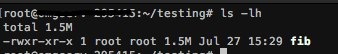

# Kpack
## custom *nix elf/exe Obsufcator (uses upx to compress the elf bin)

**Author**: - Coded By k1rk#1999

**Requirments**: - Python3.8

**Info**: - All This program does is change all the upx strings in the binary to obsufacate how the bin was compressed it does NOT 100% prevent unpacking, as once the person - reverse engineering your bin figures out that it's a upx bin they can easily patch it, still it will confuse alot of people even professionals, Another advantage - is that upx compresses your bin making it much smaller with little too no runtime delay

**Usage**: - python3.8 Kpack.py --files [space sep list of paths to elf bins] --upx [path to upx if left none program will assume upx is sym linked]

# screenshots

**File Size Before**:

